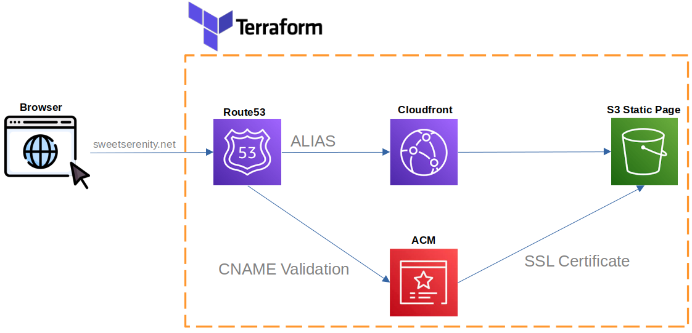

# static-page-with-aws-terraform
1. Using Terraform to deploy a static page.

Deployment steps
1. Route53 hosted zone already deployed with custom domain sweetserenity.net.
2. Generate SSL certificate using ACM. Validate the certificate. Add CNAME record to hosted zone in Route53
3. Deploy S3 bucket, configure S3 ACL access
4. Create cloudfront distribution and point to S3 bucket, attach SSL certificate, add alternate domain name (point to CNAME record)
5. Create A record in Route53 to point to cloudfront distribution

